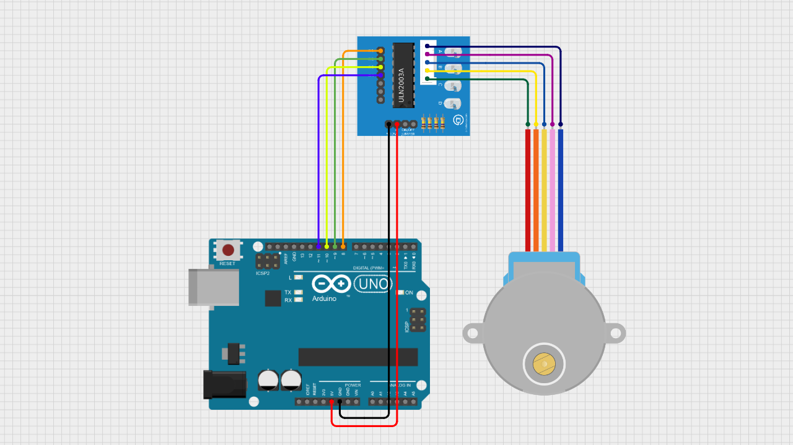

# Arduino Stepper Motor Test

A beginner-friendly Arduino project demonstrating how to control a 28BYJ-48 stepper motor using the ULN2003 driver module.

This project shows how to rotate the motor clockwise and counterclockwise with precise step control using simple Arduino code.

---

## 📌 Project Overview

Unlike DC motors that spin continuously, a stepper motor moves in discrete steps.

This allows precise control of position and rotation.

The 28BYJ-48 stepper motor is widely used for beginners because it is affordable and easy to interface using the ULN2003 driver board.

In this project, Arduino controls the motor by sending step signals:

- Clockwise rotation → Positive steps  
- Counterclockwise rotation → Negative steps  

---

## 🧰 Components Required

- Arduino Uno / Nano  
- 28BYJ-48 Stepper Motor  
- ULN2003 Driver Module  
- Jumper Wires  
- Breadboard (optional)  

---

## 🔌 Wiring Connections

| ULN2003 Driver | Arduino |
|---------------|--------|
| IN1           | Pin 8  |
| IN2           | Pin 9  |
| IN3           | Pin 10 |
| IN4           | Pin 11 |
| VCC           | 5V     |
| GND           | GND    |

> The stepper motor plugs directly into the ULN2003 driver module.

---

## 📷 Wiring Diagram

> Make sure your wiring matches the diagram above before uploading the code.

---

## 💻 Arduino Code

You can download the Arduino sketch here:

[Download Arduino Code](arduino-stepper-motor-test.ino)

Or open the `.ino` file directly inside this repository.

---

## 🚀 Getting Started

1. Connect all components according to the wiring table.
2. Upload the provided Arduino sketch.
3. Open **Serial Monitor**.
4. Set baud rate to **9600**.
5. Observe the motor rotating clockwise and counterclockwise.

---

## 🧠 Learning Concepts

This project helps you understand:

- Stepper motor basics  
- Digital output control  
- Motor direction control  
- Step-based movement  
- Serial communication basics  

---

## 🔄 Possible Improvements

You can expand this project by adding:

- Speed control using potentiometer  
- Button control (start/stop)  
- LCD display integration  
- Direction toggle switch  
- Acceleration control (advanced)  

---

## 🎥 Video Tutorial

Watch the full step-by-step tutorial on YouTube:

👉 https://youtu.be/YOUR_VIDEO_LINK

In this video, you will see:
- Complete wiring demonstration  
- Code explanation  
- Clockwise and counterclockwise rotation  
- Real motor testing  

If this project helps you, consider subscribing for more beginner-friendly Arduino tutorials 🚀

---

## 📄 License

This project is open-source and free to use for educational purposes.

---

Happy Coding 🚀
